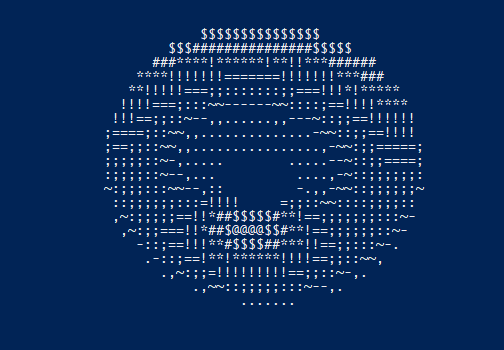

## DonutPy - a one-line Python implementation for [donut.c](https://www.a1k0n.net/2006/09/15/obfuscated-c-donut.html)

Unlike the original, its source code doesn't compose a torus shape. However, it was built purposefully to fit in a single Python line.

Just like `donut.c`, if executed in ANSI or VT100 mode, it will produce the following result:

